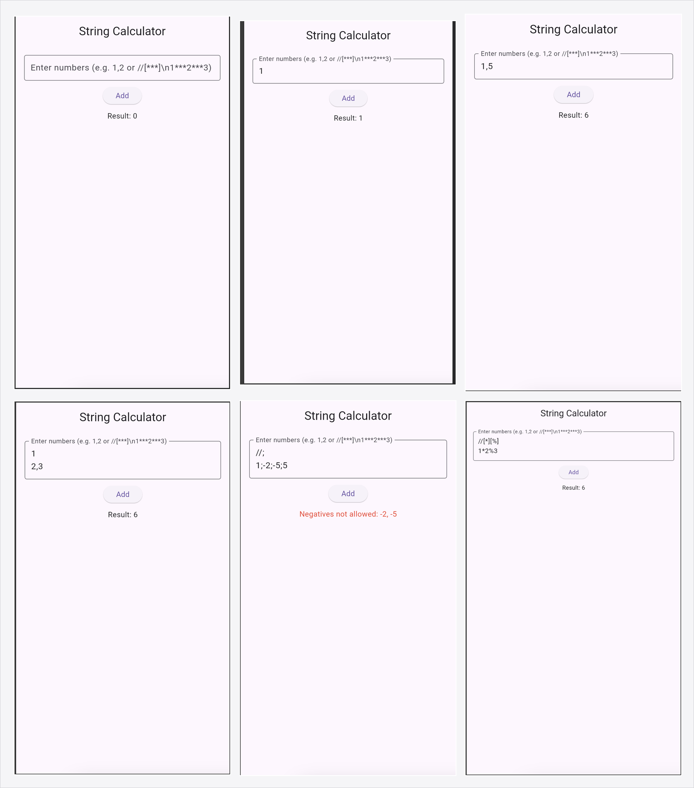
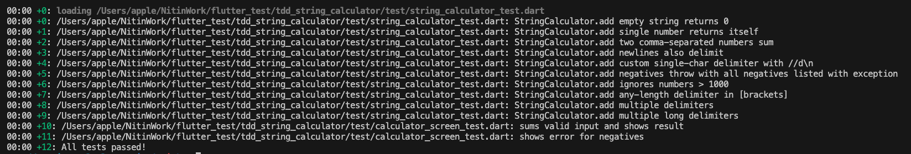

# String Calculator — Flutter + TDD (with Widget Tests & DI)

A tiny project to **practice Test-Driven Development** in Flutter/Dart:

- Core logic: **String Calculator** kata (unit tests).
- Minimal UI: a text field + button + result/error (widget tests).
- **Dependency Injection (DI):** UI receives a calculator via constructor.
- **Frequent commits** showing **RED → GREEN → REFACTOR**.

---

## GitHub Actions

[](https://github.com/NTJ3/tdd_string_calculator/actions/workflows/flutter.yml)

---

## Requirements

- Flutter 3.32.5 (stable channel)
- Dart 3.8.1

---

## Quick Start

```bash
flutter pub get
flutter test -r expanded     # run all tests
flutter run                  # launch the demo UI
```

---

## Project Structure

```bash
.
├── lib/
│   ├── string_calculator.dart     # Calculator interface + implementation + exception
│   └── ui/
│       └── calculator_screen.dart   # Minimal UI (DI via constructor)
├── test/
│   ├── string_calculator_test.dart      # Unit tests (TDD steps)
│   └── calculator_screen_test.dart      # Widget tests (UI behavior)
├── .github/workflows/
│   └── flutter.yml                # CI: runs tests on push/PR
└── pubspec.yaml

```

---


---

## String Calculator Rules (implemented)

1. `""` → `0`  
2. `"1"` → `1`, `"1,2"` → `3`  
3. Newlines allowed: `"1\n2,3"` → `6`  
4. Custom delimiter: `"//;\n1;2"` → `3`  
5. Negatives throw with **all** negatives listed  
6. Ignore numbers `> 1000`  
7. Any-length delimiter: `"//[***]\n1***2***3"` → `6`  
8. Multiple delimiters: `"//[*][%]\n1*2%3"` → `6`  
9. Multiple long delimiters: `"//[**][%%]\n1**2%%3"` → `6`

---

## Dependency Injection (DI) in this repo

- `abstract class Calculator { int add(String input); }`
- `class StringCalculator implements Calculator { ... }`
- `CalculatorScreen({ required Calculator calculator })` ← **injected** dependency  
  In widget tests you can inject a **Fake** that returns a fixed value or throws to test UI behavior.

---

## Continuous Integration (CI)

GitHub Actions workflow at `.github/workflows/flutter.yml`:

- Checks out code
- Installs Flutter (stable)
- Runs `flutter pub get` and `flutter test -r expanded`

All pushes and PRs trigger the pipeline.

---

### Attachments

| Name             | Image                                                                |
| ----------------- | ------------------------------------------------------------------ |
| App Images |  |
| Test Cases |  |


---

## License

MIT (or your preferred license)
